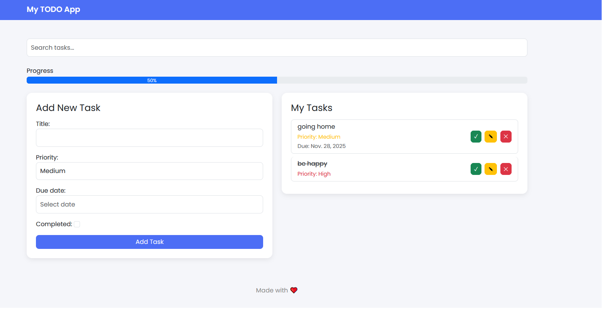

# Django TODO App  



A clean, modern, user-friendly TODO application built with **Django**, styled with **Bootstrap 5**, and designed with the help of **ChatGPT** prompts to improve both layout and functionality.

---

## ✨ Features

- Add, edit, and delete tasks  
- Mark tasks as completed / uncompleted  
- Priority selection (High/Medium/Low)  
- Due date calendar picker (Flatpickr)  
- Modern Bootstrap 5 interface  
- Responsive UI  
- Search bar for filtering tasks  
- Beautiful design with custom styling  

---

## 🤖 Built with ChatGPT

This project was developed through an iterative process using ChatGPT prompts.  
I asked ChatGPT to help me:

- create the Django project structure  
- build models, views, forms, and templates  
- improve the UI with Bootstrap  
- add animations, colors, and better layout  
- debug issues such as migrations, templates, and forms  
- modernize the interface step by step  

Throughout development, I provided ChatGPT with code, error messages, and UI requirements, and refined the app based on the responses.

---

## 🛠️ Tech Stack

- **Python 3.12**
- **Django 5**
- **Bootstrap 5**
- **Flatpickr** (for date picker)
- **HTML + CSS**

---

## 🚀 Installation

Clone the repository:

```bash
git clone https://github.com/HagerAhmed/ai-dev-tools.git
cd todo_project
```

## Create a virtual environment and install dependencies:
```bash
python -m venv .venv
source .venv/bin/activate   # Windows: .venv\Scripts\activate
pip install -r requirements.txt
```

## Run migrations:

```bash
python manage.py migrate
```

## Start the server:

```bash
python manage.py runserver
```
